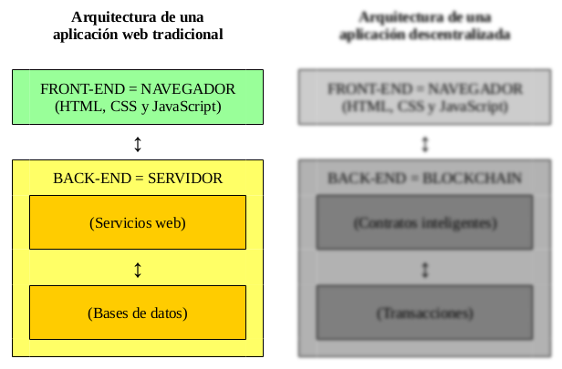
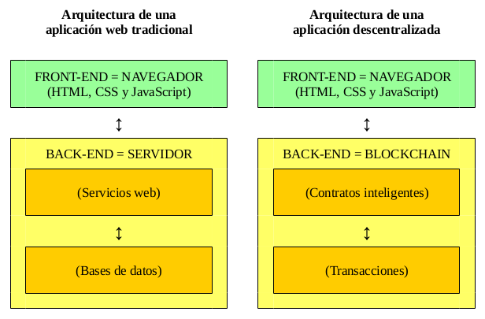
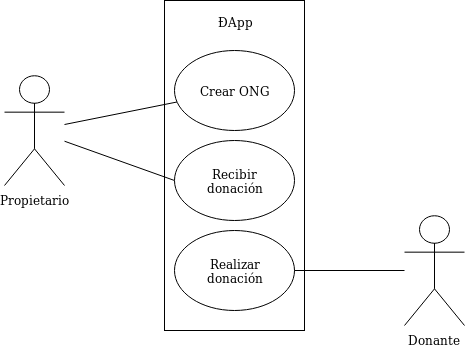
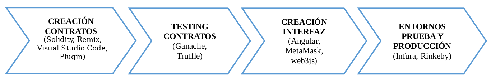

% Desarrollo ÐApp de Expedientes Académicos en Blockchain de Ethereum
% Adolfo Sanz De Diego
% Septiembre 2018

# Indice

## ¿Qué vamos a ver?

> 1. Parte teorica
> 2. Descripción ÐApp
> 3. Creación Smart Contracts
> 4. Testing Smart Contracts
> 5. Creación UI
> 6. Subida a entornos de prueba

# Teoría

## ¿Qué es Bitcoin?

> - **Protocolo y red P2P** = dinero digital.
> - **Claves privadas** = transferir fondos.
> - **Descentralizado** = no necesitan un tercero.

## ¿Qué es Blockchain?

> - Datos se guardan en **cadena de bloques** con información del anterior.
> - **Histórico transacciones** difícilmente falsificable.
> - Transacciones verificadas **de forma descentralizada** ¿cómo?

## ¿Qué es el Minado?

> - Generación nuevos bloques.
> - Problema **elegir el bloque correcto** ¿cómo?

## ¿Mecanismos de consenso?

> - **Prueba de trabajo o PoW** = recompensa al primer minero en resolver problema gasto computacional elevado, pero verificación inmediata.
>       - Elevado gasto energético.
> - **Prueba de participación o PoS** = probabilidad de obtener recompensa proporcional a monedas acumuladas.
>       - Problemas en caso de una bifurcación de la cadena.

## ¿Tipos de Blockchains?

> - **públicas**: cualquiera puede minar y las transacciones son públicas.
> - **privadas**: solo se puede minar por invitación y las transacciones solo las pueden ver los mineros.
> - **mixtas**: solo se puede minar por invitación pero las transacciones son públicas.

## ¿Qué es Ethereum?

> - Blockchain pública que **ejecuta código y guarda datos** de forma descentralizada.
> - **Solidity** = compila a bytecode interpreta Ethereum Virtual Machine (EVM).
> - **Gas** = coste ejecución en Ethers.

## ¿Qué es un Smart Contract?

> - Programa informático en blockchain.
>       - **Autónomo**: no necesita ningún servidor.
>       - **Confiable**: trazabilidad de los datos.
>       - **Imparable**: ejecutarse siempre.
>       - **Inmutable**: no se puede modificar.
>       - **Descentralizado**: no necesita tercero para ser verificado.

## ¿Apps tradicionales?

## ¿Apps descentralizadas?

## Resumen

> - **Bitcoin** = dinero descentralizado.
> - **Blockchain** = cadena de bloques dificilmente falsificable.
> - **Minado** = geneación bloques con mecanismos de consenso.
> - **Ethereum** = blockchain pública permite ejecutar código y guardar datos.
> - **Smart Contract** = programa que se ejecuta en una blockchain.
> - **ÐApp** = aplicación que utiliza smart contracts.

# Descripción ÐApp

## ÐApp de donaciones a ONG

> - Vamos a desarrollar una ÐApp para gestionar donaciones a ONG con 2 tipos de usuarios:
>       - **Propietarios**: crea la ONG y recibe las donaciones.
>       - **Otros usuarios**: realizan donaciones a las ONG.

## Casos de uso

## Demo (Rinkeby)

> - El back desplegado en la **red de pruebas** de [Rinkeby](https://www.rinkeby.io/).
> - El front desplegado en **GitHub Pages** (siendo puristas habría que usar [IPFS](https://ipfs.io/)).
>       - <https://nongovernmentalorganizations.github.io>

# Creación Smart Contracts

## ¿Entorno de desarrollo?

> - **[Solidity](https://solidity-es.readthedocs.io/es/latest/)**: lenguaje de programación.
> - **[Remix](https://remix.ethereum.org/)**: IDE en un navegador.
> - **[Visual Studio Code](https://code.visualstudio.com/)**: IDE Software Libre 
> - **[Plugin de Solidity de Juan Blanco](https://marketplace.visualstudio.com/items?itemName=JuanBlanco.solidity)**: Plugin de Solidity para Visual Studio Code

## ¿Cómo guardar datos?

> - Los datos se guardan en “structs” o **estructuras**.
> - Las estructuras de datos se guardan en **arrays**.
> - Para las relaciones se utilizan los **mappings**.

## Ejemplo

~~~{.javascript}
// Estructura
struct Organization {
    uint id;
    address owner;
    string name;
}

// Array
Organization[] public organizations;

// Mapping
mapping(address => uint) public ownerToOrganizationId;
~~~

## ¿Otros elementos?

> - **constructores** : solo se ejecutan cuando el contrato inteligente es desplegado en la blockchain.
> - **eventos**: permiten trazar lo que sucede en los contratos inteligentes.
> - **modificadores personalizados**: permiten hacer chequeos antes de ejecutar la lógica de una función.

## Ejemplo

~~~{.javascript}
// Constructor
constructor() public {
    // to fix problem with nulls
    organizations.push(Organization(0, 0, "0"));
}

// Eventos
event OrganizationCreated(
    uint indexed id, address indexed owner, string name);

// Modificadores personalizados
modifier ownerNotExists() {
    require(ownerToOrganizationId[msg.sender] == 0, 
    "suplied owner already have an organization");
    _;
}
~~~

## ¿Modificadores de visibilidad?

> - Para variables de estado y para funciones:
>       - **public**: desde otros contratos y desde el propio contrato.
>       - **external**: desde otros contratos pero no desde el propio contrato.
>       - **internal**: desde el propio contrato o de contratos que hereden de él.
>       - **private**: sólo desde el propio contrato.

## ¿Otros modificadores?

> - Para variables de estado:
>       - **constant**: pueden ser modificadas.
> - Para funciones:
>       - **view**: no pueden modificar ninguna variable de estado (no consumen Gas).
>       - **pure**: no pueden ni ver ni modificar ninguna variable de estado (no consumen Gas).
>       - **payable**: admiten envío de dinero.

## Ejemplo

~~~{.javascript}
function addOrganization(string _name) external 
    ownerNotExists() {
    ...
    emit OrganizationCreated(organizationId, msg.sender, _name);
}

function donation(uint _organizationId) external payable
    ownerExists(_organizationId) {
    ...
    emit DonationSubmitted(_organizationId, owner, msg.sender, msg.value);
}

function getOrganizationsLength() external view returns(uint) {

    return organizations.length;
}
~~~

## ¿Comentarios generales?

> - Muchas limitaciones, por eso reducir la lógica al mínimo.
> - Los bucles están muy desaconsejados (gas), por eso se usan los mappings.
> - La ejecución es lenta, por eso implementar políticas de cacheo.
> - Aspectos en proceso de mejora como tratamiento excepciones.

## Resumen

> - **Entorno**: Solidity, Remix, Plugin, Solium.
> - **Datos**: estructuras, arrays y mapings.
> - **Otros**: constructores y eventos.
> - **Modificadores**: visibilidad, otros y personalizado.
> - **Comentarios**: limitaciones, ejecución lenta, mejorando.

# Testing Smart Contracts

## Ganache

- [Ganache](https://truffleframework.com/ganache) es un **nodo privado** para desarrollar y testear sin coste.

~~~{.bash}
# instalar
npm install -g ganache-cli
~~~

~~~{.bash}
# ejecutar
ganache-cli --gasLimit 7000001 --mnemonic "$(cat wallet.mnemonic)"
~~~

## Truffle

- [Truffle](https://truffleframework.com/) es un **framework de desarrollo** de smarts contracts de Ethreum.

~~~{.bash}
# instalar
npm install -g truffle
~~~

## Compilar

- Una vez creado los smarts contracts hay que compilarlos:

~~~{.bash}
# compilar
truffle compile
~~~

## Migrar

- Una vez levantado el nodo privado (Ganache) en una terminal independiente, tenemos que migrar los smarts contracts compilados:

~~~{.bash}
# migrar
truffle migrate
~~~

## Tests

~~~{.javascript}
var NonGovernmentalOrganizations = artifacts
    .require("NonGovernmentalOrganizations");
contract("NonGovernmentalOrganizations", async (accounts) => {
    it("addOrganization - ok", async () => {
        let instance = await NonGovernmentalOrganizations.deployed();
        let tx = await instance.addOrganization(expectedName,
            { from: expectedOwner });
        assert.equal(tx.logs[0].event, "OrganizationCreated");
        let result = await instance.organizations.call(expectedId);
        assert.equal(result[2], expectedName);
        let ownerId = await instance.ownerToOrganizationId(expectedOwner);
        assert.equal(ownerId, expectedId);
        let length = await instance.getOrganizationsLength();
        assert.equal(length, expectedLength);
    });
});
~~~

## Testear

- Una vez creados los tests los lanzamos:

~~~{.bash}
# testear
truffle test
~~~

## Resumen

> - **Instalar Ganache**: npm install -g ganache-cli
> - **Ejecutar Ganache**: ganache-cli --gasLimit --mnemonic
> - **Instalar truffle**: npm install -g truffle
> - **Compilar**: truffle compile
> - **Migrar**: truffle migrate
> - **Testear**: truffle test

# Creación UI

## Truffle boxes

> - [Truffle boxes](https://truffleframework.com/boxes) proporciona boilerplates para no tener que empezar a desarrollar ÐApps desde cero.
> - Hay para React, aunque yo soy más de Angular :-)

## Angular

- Aunque la UI se puede hacer con otros frameworks yo he usado
[Angular](https://angular.io/) y [Angular Material](https://material.angular.io/).

~~~{.bash}
npm install -g @angular/cli
~~~

## MetaMask

> - **[MetaMask](https://metamask.io/)**: es nodo ligero y wallet de Ethereum que permite ejecutar ÐApps en un navegador.

## web3js

> - **[web3js](https://web3js.readthedocs.io/)**: es una librería de comunicación entre la interfaz de usuario y un nodo de Ethereum.

## Address usuario

~~~{.javascript}
getUserAddress() {
    if (!this.web3) {
        this.messagesService.sendErrorMessage('Try MetaMask.');
    }
    this.web3.eth.getAccounts().then(accounts => {
        if (!accounts || accounts.length === 0) {
            this.messagesService.sendErrorMessage('No user accounts.');
        }
        if (StorageUtil.getUserAddress() !== accounts[0]) {
            StorageUtil.setUserAddress(accounts[0]);
            this.messagesService.sendNewUserAddressMessage(accounts[0]);
        }
    }).catch(error => {
        this.messagesService.sendErrorMessage(error);
    });
}
~~~

## Contract instance

~~~{.javascript}
async getContractInstance(): Promise<any> {
    if (!this.web3) {
        throw new Error('web3 server not found. Try MetaMask.');
    }
    const ngoContract = contract(artifacts);
    ngoContract.setProvider(this.web3.currentProvider);
    try {
        const ngoInstance = await ngoContract.deployed();
        return ngoInstance;
    } catch (error) {
        console.log(error);
        throw new Error('Contract has not been deployed to network.');
    }
}
~~~

## Add organisation

~~~{.javascript}
async add(organization: Organization): Promise<Organization> {
    const contractInstance = await this.web3Service.getContractInstance();
    const oldOrganization = await this.getCurrentUserOrganizationAsOwner();
    if (oldOrganization) {
        throw new Error('The user is already owner of an organization.');
    }
    const transaction = await contractInstance.addOrganization(
        organization.name, { from: this.senderAddress });
    const newOrganization = this._getOrganizationFromTransaction(transaction);
    this.organizations.push(newOrganization);
    console.log('OrganizationService->add', newOrganization);
    return newOrganization;
}
~~~

## Donation

~~~{.javascript}
async donation(id: number, ethValue: number): Promise<Donation> {
    const organization = await this.getOne(id);
    const contractInstance = await this.web3Service.getContractInstance();
    const weiValue = this.web3Service.etherToWei(ethValue.toString());
    const transaction = await contractInstance.donation(organization.id, 
        { value: weiValue, from: this.senderAddress });
    const donation = await this._getDonationFromTransaction(transaction);
    console.log('OrganizationService->donation', donation);
    return donation;
}
~~~

## Resumen

> - **[Truffle boxes](https://truffleframework.com/boxes)**: boilerplates.
> - **[Angular](https://angular.io/)**: npm install -g @angular/cli
> - **[MetaMask](https://metamask.io/)**: nodo ligero y wallet de Ethereum.
> - **[web3js](https://web3js.readthedocs.io/)**: librería de comunicación.

# Subida a entornos de prueba

## Infura

> - **[Infura](https://infura.io/)**: simplifica el despliegue de ÐApps en redes de prueba y en la red principal.
> - Te creas un usuario y te facilita un **API Key**.

## Rinkeby

> - **[Rinkeby](https://www.rinkeby.io/)**: red de pruebas para probar ÐApps.
> - Mediante **faucets** consigues ETH de la red.

## truffle.js

~~~{.javascript}
var HDWalletProvider = require("truffle-hdwallet-provider");
module.exports = {
  networks: {
    rinkeby: {
      provider: function () {
        let provider = new HDWalletProvider(
          walletMmnemonic,
          "https://rinkeby.infura.io/v3/" + apiKey);
        return provider;
      },
      gas: 7000001,
      network_id: 4
    }
  }
};
~~~

## Migrar a rinkeby

- Para migrar a Rinkeby tenemos que usar la **apiKey** de Infura y una **walletMmnemonic** de una wallet con saldo suficiente en Rinkeby y ejecutar:

~~~{.bash}
truffle migrate --network rinkeby
~~~

# Resumen

## ¿Creación contratos inteligentes?

> - **[Solidity](https://solidity-es.readthedocs.io/es/latest/)**: lenguaje de programación.
> - **[Remix](https://remix.ethereum.org/)**: IDE en un navegador.
> - **[Visual Studio Code](https://code.visualstudio.com/)**: IDE Software Libre 
> - **[Plugin de Solidity de Juan Blanco](https://marketplace.visualstudio.com/items?itemName=JuanBlanco.solidity)**: Plugin de Solidity para Visual Studio Code

## ¿Testing contratos inteligentes?

> - **[Ganache](https://truffleframework.com/ganache)**: nodo privado para desarrollar y testear sin coste.
> - **[Truffle](https://truffleframework.com/)**: framework de desarrollo de smarts contracts de Ethreum.

## ¿Creación interfaz de usuario?

> - **[Angular](https://angular.io/)**: framework de desarrollo de interfaces de usuario.
> - **[MetaMask](https://metamask.io/)**: nodo ligero y wallet de Ethereum permite ejecutar ÐApps en navegador.
> - **[web3js](https://web3js.readthedocs.io/)**: librería comunicación entre interfaz de usuario y nodo de Ethereum.

## ¿Subida a entornos de prueba?

> - **[Infura](https://infura.io/)**: simplifica el despliegue de ÐApps en redes de prueba y en la red principal.
> - **[Rinkeby](https://www.rinkeby.io/)**: red de pruebas para probar ÐApps.

## ¿Conclusiones?

> - Tecnologías nuevas, pero ya se pueden empezar a implantar los primeros proyectos en producción.
> - Tecnologías muy disruptivas por la descentralización y por la trazabilidad de los datos.
> - Problemas de escalabilidad y de volatilidad de precios.

## Resumen

> - **Creación**: Solidity, Remix, VSCOde, Plugin.
> - **Testing**: Ganache, Truffle.
> - **UI**: Angular, MetaMask, web3js.
> - **Prueba**: Infura, Rinkeby.
> - **Conclusiones**: descentralización y trazabilidad.

# Acerca de

## Licencia

[Creative Commons Reconocimiento-CompartirIgual 3.0](http://creativecommons.org/licenses/by-sa/3.0/es/)

## Fuentes

[github.com/asanzdiego/commit-conf-taller-blockchain](https://github.com/asanzdiego/commit-conf-taller-blockchain)

## Slides

Las slides están hechas con **[MarkdownSlides](https://github.com/markdownslides/markdownslides>)**.

# Preguntas

# Gracias